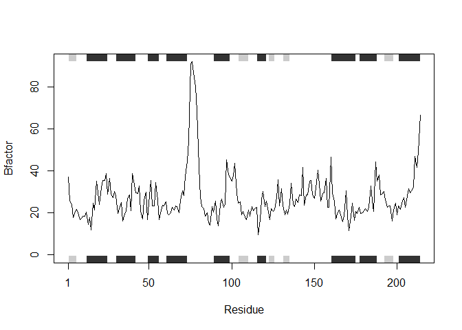

Class 06: R Functions
================
Seth McNeely
1/23/2020

# Functions

## Importing

Let’s see more about file import (i.e. reading files into R). The main
read function in base R is `read.table()`:

``` r
t1 <- read.table("test1.txt")
t1
```

    ##               V1
    ## 1 Col1,Col2,Col3
    ## 2          1,2,3
    ## 3          4,5,6
    ## 4          7,8,9
    ## 5          a,b,c

We need to add arguments to get this file imported in a proper format:

``` r
t1 <- read.table("test1.txt", sep=",", header=TRUE)
t1
```

    ##   Col1 Col2 Col3
    ## 1    1    2    3
    ## 2    4    5    6
    ## 3    7    8    9
    ## 4    a    b    c

Or I could use `read.csv()` which has these arguments by default\!

``` r
t1 <- read.csv("test1.txt")
t1
```

    ##   Col1 Col2 Col3
    ## 1    1    2    3
    ## 2    4    5    6
    ## 3    7    8    9
    ## 4    a    b    c

## Simple functions

Our first example function:

``` r
add <- function(x, y=1) {
  # Sum the input x and y (y = 1)
  x + y
}
```

This function requires an input “x,” but also allows an optional input
“y”. By default, we gave “y” the value of 1. Now, let’s try this
function out\!

``` r
# Adding input x to input y
add(7, 3)
```

    ## [1] 10

How does this work with vectors as input?

``` r
# Adding input vector x to default y
add(c(1,2,4))
```

    ## [1] 2 3 5

``` r
# Adding inout vector x to input y
add(c(1,2,4), 4)
```

    ## [1] 5 6 8

``` r
#Adding input vector x to inout vector y
add(c(1,2,4), c(1,2,4))
```

    ## [1] 2 4 8

## Let’s move on\!

What about this `range()` function?

``` r
x <- c(1,2,4)
min(x)
```

    ## [1] 1

``` r
max(x)
```

    ## [1] 4

``` r
range(x)
```

    ## [1] 1 4

This is our second function:

``` r
rescale <- function(x) {
  rng <- range(x)
  (x-rng[1]) / (rng[2] - rng[3])
}
```

``` r
rescale(x)
```

    ## [1] NA NA NA

Some more uses of our function:

``` r
# What will this do?
rescale(c(1,2,NA,3,10))
```

    ## [1] NA NA NA NA NA

``` r
# How do we fix this?
```

``` r
x <- c(1,2,NA,3,10)
rng <- range(x)
rng
```

    ## [1] NA NA

``` r
# How do we fix this?
```

Let’s create a new function and add a new argument to remove our missing
values:

``` r
rescale2 <- function(x) {
  rng <- range(x, na.rm=TRUE)
  (x - rng[1]) / (rng[2] - rng[1])
}
```

``` r
rescale2(c(1,2,NA,3,10))
```

    ## [1] 0.0000000 0.1111111        NA 0.2222222 1.0000000

Going too far\!

``` r
rescale3 <- function(x, na.rm=TRUE, plot=FALSE) {
  rng <-range(x, na.rm=na.rm)
  print("Hello")
  
  answer <- (x - rng[1]) / (rng[2] - rng[1])
  print("is it me you are looking for?")
  
  if(plot) {
    plot(answer, typ="b", lwd=4)
  }
  
  print("I can see it in ...")
  return(answer)
}
```

``` r
rescale3(x, plot=FALSE)
```

    ## [1] "Hello"
    ## [1] "is it me you are looking for?"
    ## [1] "I can see it in ..."

    ## [1] 0.0000000 0.1111111        NA 0.2222222 1.0000000

``` r
rescale3(x, plot=TRUE)
```

    ## [1] "Hello"
    ## [1] "is it me you are looking for?"

<!-- -->

    ## [1] "I can see it in ..."

    ## [1] 0.0000000 0.1111111        NA 0.2222222 1.0000000

### Section B

``` r
library(bio3d)
```

``` r
# Can you improve this analysis code?
library(bio3d)
s1 <- read.pdb("4AKE") # kinase with drug
```

    ##   Note: Accessing on-line PDB file

``` r
s2 <- read.pdb("1AKE") # kinase no drug
```

    ##   Note: Accessing on-line PDB file
    ##    PDB has ALT records, taking A only, rm.alt=TRUE

``` r
s3 <- read.pdb("1E4Y") # kinase with drug
```

    ##   Note: Accessing on-line PDB file

``` r
s1.chainA <- trim.pdb(s1, chain="A", elety="CA")
s2.chainA <- trim.pdb(s2, chain="A", elety="CA")
s3.chainA <- trim.pdb(s1, chain="A", elety="CA")

s1.b <- s1.chainA$atom$b
s2.b <- s2.chainA$atom$b
s3.b <- s3.chainA$atom$b

plotb3(s1.b, sse=s1.chainA, typ="l", ylab="Bfactor")
```

<!-- -->

``` r
plotb3(s2.b, sse=s2.chainA, typ="l", ylab="Bfactor")
```

<!-- -->

``` r
plotb3(s3.b, sse=s3.chainA, typ="l", ylab="Bfactor")
```

<!-- -->

Q1. What type of object is returned from the read.pdb() function?

``` r
class(s1)
```

    ## [1] "pdb" "sse"

``` r
str(s1)
```

    ## List of 8
    ##  $ atom  :'data.frame':  3459 obs. of  16 variables:
    ##   ..$ type  : chr [1:3459] "ATOM" "ATOM" "ATOM" "ATOM" ...
    ##   ..$ eleno : int [1:3459] 1 2 3 4 5 6 7 8 9 10 ...
    ##   ..$ elety : chr [1:3459] "N" "CA" "C" "O" ...
    ##   ..$ alt   : chr [1:3459] NA NA NA NA ...
    ##   ..$ resid : chr [1:3459] "MET" "MET" "MET" "MET" ...
    ##   ..$ chain : chr [1:3459] "A" "A" "A" "A" ...
    ##   ..$ resno : int [1:3459] 1 1 1 1 1 1 1 1 2 2 ...
    ##   ..$ insert: chr [1:3459] NA NA NA NA ...
    ##   ..$ x     : num [1:3459] -10.93 -9.9 -9.17 -9.8 -10.59 ...
    ##   ..$ y     : num [1:3459] -24.9 -24.4 -23.3 -22.3 -24 ...
    ##   ..$ z     : num [1:3459] -9.52 -10.48 -9.81 -9.35 -11.77 ...
    ##   ..$ o     : num [1:3459] 1 1 1 1 1 1 1 1 1 1 ...
    ##   ..$ b     : num [1:3459] 41.5 29 27.9 26.4 34.2 ...
    ##   ..$ segid : chr [1:3459] NA NA NA NA ...
    ##   ..$ elesy : chr [1:3459] "N" "C" "C" "O" ...
    ##   ..$ charge: chr [1:3459] NA NA NA NA ...
    ##  $ xyz   : 'xyz' num [1, 1:10377] -10.93 -24.89 -9.52 -9.9 -24.42 ...
    ##  $ seqres: Named chr [1:428] "MET" "ARG" "ILE" "ILE" ...
    ##   ..- attr(*, "names")= chr [1:428] "A" "A" "A" "A" ...
    ##  $ helix :List of 4
    ##   ..$ start: Named num [1:19] 13 31 44 61 75 90 113 161 202 13 ...
    ##   .. ..- attr(*, "names")= chr [1:19] "" "" "" "" ...
    ##   ..$ end  : Named num [1:19] 24 40 54 73 77 98 121 187 213 24 ...
    ##   .. ..- attr(*, "names")= chr [1:19] "" "" "" "" ...
    ##   ..$ chain: chr [1:19] "A" "A" "A" "A" ...
    ##   ..$ type : chr [1:19] "5" "1" "1" "1" ...
    ##  $ sheet :List of 4
    ##   ..$ start: Named num [1:14] 192 105 2 81 27 123 131 192 105 2 ...
    ##   .. ..- attr(*, "names")= chr [1:14] "" "" "" "" ...
    ##   ..$ end  : Named num [1:14] 197 110 7 84 29 126 134 197 110 7 ...
    ##   .. ..- attr(*, "names")= chr [1:14] "" "" "" "" ...
    ##   ..$ chain: chr [1:14] "A" "A" "A" "A" ...
    ##   ..$ sense: chr [1:14] "0" "1" "1" "1" ...
    ##  $ calpha: logi [1:3459] FALSE TRUE FALSE FALSE FALSE FALSE ...
    ##  $ remark:List of 1
    ##   ..$ biomat:List of 4
    ##   .. ..$ num   : int 1
    ##   .. ..$ chain :List of 1
    ##   .. .. ..$ : chr [1:2] "A" "B"
    ##   .. ..$ mat   :List of 1
    ##   .. .. ..$ :List of 1
    ##   .. .. .. ..$ A B: num [1:3, 1:4] 1 0 0 0 1 0 0 0 1 0 ...
    ##   .. ..$ method: chr "AUTHOR"
    ##  $ call  : language read.pdb(file = "4AKE")
    ##  - attr(*, "class")= chr [1:2] "pdb" "sse"

Q2. What does the trim.pdb() function do?

``` r
?trim.pdb()
```

    ## starting httpd help server ... done

Q3. What input parameter would turn off the marginal black and grey
rectangles in the plots and what do they represent in this case?

Q4. What would be a better plot to compare across the different
proteins?

``` r
plotb3(s1.b, sse=s1.chainA, typ="l", ylab="Bfactor")
points(s2.b, ty="l", col="blue")
points(s3.b, ty="l", col="red")
```

<!-- -->

Q5. Which proteins are more similar to each other in their B-factor
trends. How could you quantify this?

``` r
hc <- hclust( dist( rbind(s1.b, s2.b, s3.b) ) )
plot(hc)
```

<!-- -->

Q6. How would you generalize the original code above to work with any
set of input protein structures? *For homework*
