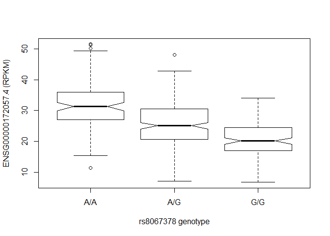
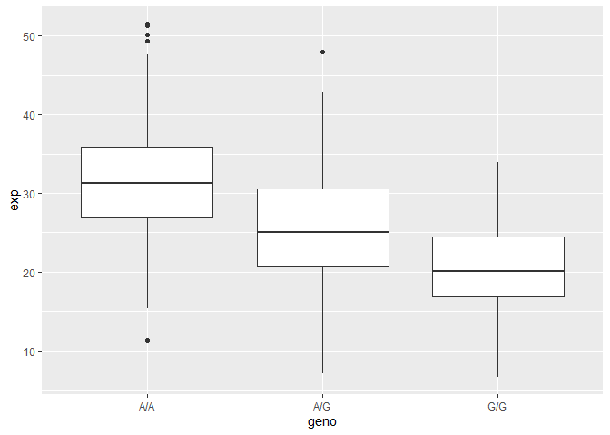
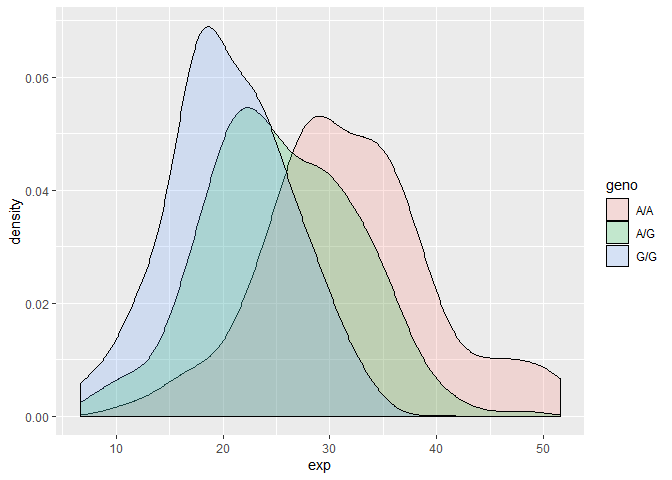
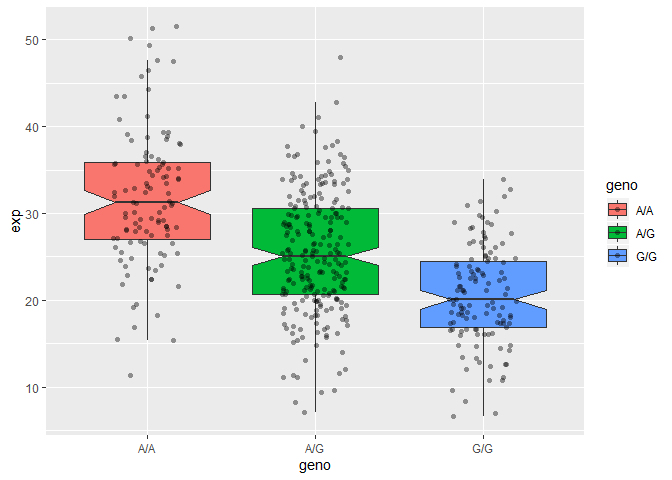

Class 14: Genome Informatics and High Throughput Sequencing
================

## Identify genetic variants of interest

> Q1. What are those 4 candidate SNPs?

rs12936231, rs8067378, rs9303277, and rs7216389

> Q2. What three genes do these variants overlap or affect?

ZPBP2, GSDMB, and ORMDL3

> Q3. What is the location of rs8067378 and what are the different
> alleles for rs8067378?

Chromosome 17: 39895095 (forward strand) A/G variants (43% G)

> Q4. What are the downstream genes for rs8067378? Any genes named
> ZPBP2, GSDMB, and ORMDL3?

> Q5. What proportion of the Mexican Ancestry in Los Angeles sample
> population (MXL) are homozygous for the asthma associated SNP (G|G)?

14%

> Q6. Back on the ENSEMBLE page, search for the particular sample
> HG00109. This is a male from the GBR population group. What is the
> genotype for this sample?

G|G

## Inital RNA-Seq Analysis

> Q7. How many sequences are there in the first file? What is the file
> size and format of the data?

> Q8. Does the first sequence have good quality?

asc( s2c(“DDDDCDEDCDDDDBBDDDCC@”) )

> Q9. What is the GC content and sequence length of the second fastq
> file?

> Q10. How about per base sequence quality? Does any base have a mean
> quality score below 20?

## Mapping RNA-Seq Reads to Genome

> Q11. Where are most the accepted hits located?

> Q12. Following Q11, is there any interesting gene around that area?

> Q13. Cufflinks again produces multiple output files that you can
> inspect from your righthand-side galaxy history. From the “gene
> expression” output, what is the FPKM for the ORMDL3 gene? What are the
> other genes with above zero FPKM values?

136853

## Population Scale Analysis

First, we need to load our expression data from the .txt file.

``` r
expr <- read.table("results.txt")
summary(expr)
```

    ##      sample     geno          exp        
    ##  HG00096:  1   A/A:108   Min.   : 6.675  
    ##  HG00097:  1   A/G:233   1st Qu.:20.004  
    ##  HG00099:  1   G/G:121   Median :25.116  
    ##  HG00100:  1             Mean   :25.640  
    ##  HG00101:  1             3rd Qu.:30.779  
    ##  HG00102:  1             Max.   :51.518  
    ##  (Other):456

We can break it down to the three genotypes.

``` r
summary(expr[expr[,2] == "A/A",3])
```

    ##    Min. 1st Qu.  Median    Mean 3rd Qu.    Max. 
    ##   11.40   27.02   31.25   31.82   35.92   51.52

``` r
summary(expr[expr[,2] == "G/G",3])
```

    ##    Min. 1st Qu.  Median    Mean 3rd Qu.    Max. 
    ##   6.675  16.903  20.074  20.594  24.457  33.956

``` r
summary(expr[expr[,2] == "A/G",3])
```

    ##    Min. 1st Qu.  Median    Mean 3rd Qu.    Max. 
    ##   7.075  20.626  25.065  25.397  30.552  48.034

``` r
summary(expr$exp[expr$geno == "A/A"])
```

    ##    Min. 1st Qu.  Median    Mean 3rd Qu.    Max. 
    ##   11.40   27.02   31.25   31.82   35.92   51.52

Let’s generate some plots of the results.

``` r
p <- boxplot(exp~geno, data=expr, xlab="rs8067378 genotype", ylab="ENSG00000172057.4 (RPKM)", notch=T)
```

<!-- -->

``` r
p
```

    ## $stats
    ##          [,1]     [,2]     [,3]
    ## [1,] 15.42908  7.07505  6.67482
    ## [2,] 26.95022 20.62572 16.90256
    ## [3,] 31.24847 25.06486 20.07363
    ## [4,] 35.95503 30.55183 24.45672
    ## [5,] 49.39612 42.75662 33.95602
    ## 
    ## $n
    ## [1] 108 233 121
    ## 
    ## $conf
    ##          [,1]     [,2]     [,3]
    ## [1,] 29.87942 24.03742 18.98858
    ## [2,] 32.61753 26.09230 21.15868
    ## 
    ## $out
    ## [1] 51.51787 50.16704 51.30170 11.39643 48.03410
    ## 
    ## $group
    ## [1] 1 1 1 1 2
    ## 
    ## $names
    ## [1] "A/A" "A/G" "G/G"

Optional: Using ggplot2.

``` r
library(ggplot2)

# Boxplot
ggplot(expr, aes(geno, exp)) + geom_boxplot()
```

<!-- -->

``` r
# Histogram of the exp column with ggplot2
ggplot(expr, aes(exp, fill = geno)) + geom_density(alpha = 0.2)
```

<!-- -->

``` r
# Boxplot with the data shown
ggplot(expr, aes(geno, exp, fill=geno)) + geom_boxplot(notch=TRUE, outlier.shape = NA) + geom_jitter(shape=16, position=position_jitter(0.2), alpha=0.4)
```

<!-- -->

> Q14. Read this file into R and determine the sample size for each
> genotype and their corresponding median expression levels for each of
> these genotypes.

> Q15. Generate a boxplot with a box per genotype, what could you infer
> from the relative expression value between A/A and G/G displayed in
> this plot? Does the SNP effect the expression of ORMDL3?
