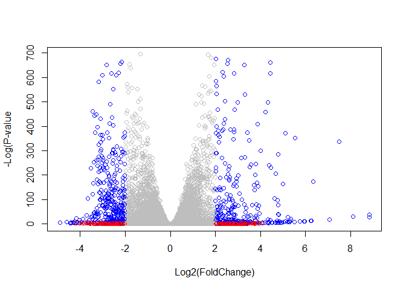

Class 16: Pathway Analysis from RNA-Seq Results
================

## 1\. Overview

Analysis of high-throughput biological data typically yields a list of
genes or proteins requiring further interpretation - for example the
ranked lists of differentially expressed genes we have been generating
from our RNA-seq analysis to date.

Our intention is typically to use such lists to gain novel insights
about genes and proteins that may have roles in a given phenomenon,
phenotype or disease progression. However, in many cases these ‘raw’
gene lists are challenging to interpret due to their large size and lack
of useful annotations. Hence, our expensively assembled gene lists often
fail to convey the full degree of possible insight about the condition
being studied.

Pathway analysis (also known as gene set analysis or over-representation
analysis), aims to reduce the complexity of interpreting gene lists via
mapping the listed genes to known (i.e. annotated) biological pathways,
processes and functions.

### 1.1 Pathway analysis with R and Bioconductor

There are many freely available tools for pathway or over-representation
analysis. As of Nov 2017 Bioconductor alone has over 80 packages
categorized under gene set enrichment and over 120 packages categorized
under pathways.

Here we play with just one, the GAGE package (which stands for Generally
Applicable Gene set Enrichment), to do KEGG pathway enrichment analysis
on RNA-seq based differential expression results.

In this analysis, we check for coordinated differential expression over
gene sets from KEGG pathways instead of changes of individual genes. The
assumption here is that consistent perturbations over a given pathway
(gene set) may suggest mechanistic changes.

### 1.2 About our input data

The data for for hands-on session comes from GEO entry: GSE37704, which
is associated with the following publication:

> Trapnell C, Hendrickson DG, Sauvageau M, Goff L et al. “Differential
> analysis of gene regulation at transcript resolution with RNA-seq”.
> Nat Biotechnol 2013 Jan;31(1):46-53. PMID: 23222703

The authors report on differential analysis of lung fibroblasts in
response to loss of the developmental transcription factor HOXA1. Their
results and others indicate that HOXA1 is required for lung fibroblast
and HeLa cell cycle progression. In particular their analysis show that
“loss of HOXA1 results in significant expression level changes in
thousands of individual transcripts, along with isoform switching events
in key regulators of the cell cycle”. For our session we have used their
Sailfish gene-level estimated counts and hence are restricted to
protein-coding genes only.

## 2\. Section 1 - Differential Expression Analysis

``` r
library(DESeq2)
```

    ## Loading required package: S4Vectors

    ## Loading required package: stats4

    ## Loading required package: BiocGenerics

    ## Loading required package: parallel

    ## 
    ## Attaching package: 'BiocGenerics'

    ## The following objects are masked from 'package:parallel':
    ## 
    ##     clusterApply, clusterApplyLB, clusterCall, clusterEvalQ,
    ##     clusterExport, clusterMap, parApply, parCapply, parLapply,
    ##     parLapplyLB, parRapply, parSapply, parSapplyLB

    ## The following objects are masked from 'package:stats':
    ## 
    ##     IQR, mad, sd, var, xtabs

    ## The following objects are masked from 'package:base':
    ## 
    ##     anyDuplicated, append, as.data.frame, basename, cbind, colnames,
    ##     dirname, do.call, duplicated, eval, evalq, Filter, Find, get, grep,
    ##     grepl, intersect, is.unsorted, lapply, Map, mapply, match, mget,
    ##     order, paste, pmax, pmax.int, pmin, pmin.int, Position, rank,
    ##     rbind, Reduce, rownames, sapply, setdiff, sort, table, tapply,
    ##     union, unique, unsplit, which, which.max, which.min

    ## 
    ## Attaching package: 'S4Vectors'

    ## The following object is masked from 'package:base':
    ## 
    ##     expand.grid

    ## Loading required package: IRanges

    ## 
    ## Attaching package: 'IRanges'

    ## The following object is masked from 'package:grDevices':
    ## 
    ##     windows

    ## Loading required package: GenomicRanges

    ## Loading required package: GenomeInfoDb

    ## Loading required package: SummarizedExperiment

    ## Loading required package: Biobase

    ## Welcome to Bioconductor
    ## 
    ##     Vignettes contain introductory material; view with
    ##     'browseVignettes()'. To cite Bioconductor, see
    ##     'citation("Biobase")', and for packages 'citation("pkgname")'.

    ## Loading required package: DelayedArray

    ## Loading required package: matrixStats

    ## 
    ## Attaching package: 'matrixStats'

    ## The following objects are masked from 'package:Biobase':
    ## 
    ##     anyMissing, rowMedians

    ## Loading required package: BiocParallel

    ## 
    ## Attaching package: 'DelayedArray'

    ## The following objects are masked from 'package:matrixStats':
    ## 
    ##     colMaxs, colMins, colRanges, rowMaxs, rowMins, rowRanges

    ## The following objects are masked from 'package:base':
    ## 
    ##     aperm, apply, rowsum

Load our data files

``` r
metaFile <- "GSE37704_metadata.csv"
countFile <- "GSE37704_featurecounts.csv"

# Import metadata and take a peak
colData = read.csv(metaFile, row.names=1)
head(colData)
```

    ##               condition
    ## SRR493366 control_sirna
    ## SRR493367 control_sirna
    ## SRR493368 control_sirna
    ## SRR493369      hoxa1_kd
    ## SRR493370      hoxa1_kd
    ## SRR493371      hoxa1_kd

``` r
# Import countdata
countData = read.csv(countFile, row.names=1)
head(countData)
```

    ##                 length SRR493366 SRR493367 SRR493368 SRR493369 SRR493370
    ## ENSG00000186092    918         0         0         0         0         0
    ## ENSG00000279928    718         0         0         0         0         0
    ## ENSG00000279457   1982        23        28        29        29        28
    ## ENSG00000278566    939         0         0         0         0         0
    ## ENSG00000273547    939         0         0         0         0         0
    ## ENSG00000187634   3214       124       123       205       207       212
    ##                 SRR493371
    ## ENSG00000186092         0
    ## ENSG00000279928         0
    ## ENSG00000279457        46
    ## ENSG00000278566         0
    ## ENSG00000273547         0
    ## ENSG00000187634       258

Remember that we need the `countData` and `colData` files to match up so
we will need to remove that odd first column in countData namely
`countData$length`.

> Q1. Complete the code below to remove the troublesome first column
> from `countData`

``` r
# We need to remove the odd first $length col
countData <- as.matrix(countData[,2:7])
head(countData)
```

    ##                 SRR493366 SRR493367 SRR493368 SRR493369 SRR493370 SRR493371
    ## ENSG00000186092         0         0         0         0         0         0
    ## ENSG00000279928         0         0         0         0         0         0
    ## ENSG00000279457        23        28        29        29        28        46
    ## ENSG00000278566         0         0         0         0         0         0
    ## ENSG00000273547         0         0         0         0         0         0
    ## ENSG00000187634       124       123       205       207       212       258

This looks better but there are lots of zero entries in there so let’s
get rid of them as we have no data for these.

> Q2. Complete the code below to filter `countData` to exclude genes
> (i.e. rows) where we have 0 read count across all samples
> (i.e. columns). Tip: What will `rowSums()` of `countdata` return and
> how could you use it in this context?

``` r
# Filter countData where you have 0 read count across all samples

countData = countData[as.logical(rowSums(countData != 0)),]
head(countData)
```

    ##                 SRR493366 SRR493367 SRR493368 SRR493369 SRR493370 SRR493371
    ## ENSG00000279457        23        28        29        29        28        46
    ## ENSG00000187634       124       123       205       207       212       258
    ## ENSG00000188976      1637      1831      2383      1226      1326      1504
    ## ENSG00000187961       120       153       180       236       255       357
    ## ENSG00000187583        24        48        65        44        48        64
    ## ENSG00000187642         4         9        16        14        16        16

### 1.1 Running DESeq2

Now lets setup the DESeqDataSet object required for the `DESeq()`
function and then run the DESeq pipeline.

``` r
dds = DESeqDataSetFromMatrix(countData=countData,
                             colData=colData,
                             design=~condition)
dds = DESeq(dds)
```

    ## estimating size factors

    ## estimating dispersions

    ## gene-wise dispersion estimates

    ## mean-dispersion relationship

    ## final dispersion estimates

    ## fitting model and testing

``` r
dds
```

    ## class: DESeqDataSet 
    ## dim: 15975 6 
    ## metadata(1): version
    ## assays(4): counts mu H cooks
    ## rownames(15975): ENSG00000279457 ENSG00000187634 ... ENSG00000276345
    ##   ENSG00000271254
    ## rowData names(22): baseMean baseVar ... deviance maxCooks
    ## colnames(6): SRR493366 SRR493367 ... SRR493370 SRR493371
    ## colData names(2): condition sizeFactor

Next, get results for the HoxA1 knockdown versus control siRNA (remember
that these were labeled as “hoxa1\_kd” and “control\_sirna” in our
original `colData` metaFile input to DESeq

``` r
res = results(dds, contrast=c("condition", "hoxa1_kd", "control_sirna"))
```

> Q3. Call the `summary()` function on your results to get a sense of
> how many genes are up or down-regulated at the default 0.1 p-value
> cutoff

``` r
summary(res)
```

    ## 
    ## out of 15975 with nonzero total read count
    ## adjusted p-value < 0.1
    ## LFC > 0 (up)       : 4349, 27%
    ## LFC < 0 (down)     : 4396, 28%
    ## outliers [1]       : 0, 0%
    ## low counts [2]     : 1237, 7.7%
    ## (mean count < 0)
    ## [1] see 'cooksCutoff' argument of ?results
    ## [2] see 'independentFiltering' argument of ?results

### 1.2 Volcano plot

Now we will make a volcano plot, a commonly produced visualization from
this type of data that we introduced last day. Basically it’s a plot of
log2 fold change vs -log adjusted p-value.

``` r
plot(res$log2FoldChange, -log(res$padj))
```

<!-- -->

> Q4. Improve this plot by completing the code below, which adds color
> and axis labels

``` r
# Make a color vector for all genes
mycols <- rep("gray", nrow(res))

# Color red the genes with absolute fold change above 2
mycols[abs(res$log2FoldChange) > 2] <- "red"

# Color blue those with adjusted p-value less than 0.01 and absolute fold change more than 2
inds <- (abs(res$pvalue) < 0.01) & (abs(res$log2FoldChange) > 2)
mycols[inds] <- "blue"

plot(res$log2FoldChange, -log(res$padj), col=mycols, xlab="Log2(FoldChange)", ylab="-Log(P-value")
```

<!-- -->

### 1.3 Adding gene annotation

Since we mapped and counted against the Ensembl annotation, our results
only have information about Ensembl gene IDs. However, our pathway
analysis downstream will use KEGG pathways, and genes in KEGG pathways
are annotated with Entrez gene IDs.

> Q5. Use the `mapIDs()` function multiple times to add SYMBOL, ENTREZID
> and GENENAME annotation to our results by completing the code below.

``` r
library("AnnotationDbi")
library("org.Hs.eg.db")
```

    ## 

``` r
columns(org.Hs.eg.db)
```

    ##  [1] "ACCNUM"       "ALIAS"        "ENSEMBL"      "ENSEMBLPROT"  "ENSEMBLTRANS"
    ##  [6] "ENTREZID"     "ENZYME"       "EVIDENCE"     "EVIDENCEALL"  "GENENAME"    
    ## [11] "GO"           "GOALL"        "IPI"          "MAP"          "OMIM"        
    ## [16] "ONTOLOGY"     "ONTOLOGYALL"  "PATH"         "PFAM"         "PMID"        
    ## [21] "PROSITE"      "REFSEQ"       "SYMBOL"       "UCSCKG"       "UNIGENE"     
    ## [26] "UNIPROT"

``` r
res$symbol = mapIds(org.Hs.eg.db,
                    keys=row.names(res),
                    keytype="ENSEMBL",
                    column="SYMBOL",
                    multiVals="first")
```

    ## 'select()' returned 1:many mapping between keys and columns

``` r
res$entrez = mapIds(org.Hs.eg.db,
                    keys=row.names(res),
                    keytype="ENSEMBL",
                    column="ENTREZID",
                    multiVals="first")
```

    ## 'select()' returned 1:many mapping between keys and columns

``` r
res$name = mapIds(org.Hs.eg.db,
                    keys=row.names(res),
                    keytype="ENSEMBL",
                    column="GENENAME",
                    multiVals="first")
```

    ## 'select()' returned 1:many mapping between keys and columns

``` r
head(res, 10)
```

    ## log2 fold change (MLE): condition hoxa1_kd vs control_sirna 
    ## Wald test p-value: condition hoxa1 kd vs control sirna 
    ## DataFrame with 10 rows and 9 columns
    ##                          baseMean     log2FoldChange              lfcSE
    ##                         <numeric>          <numeric>          <numeric>
    ## ENSG00000279457  29.9135794276176   0.17925708367269  0.324821565250145
    ## ENSG00000187634  183.229649921658  0.426457118403306  0.140265820376892
    ## ENSG00000188976  1651.18807619944 -0.692720464846366 0.0548465415913946
    ## ENSG00000187961  209.637938486147  0.729755610585225  0.131859899969345
    ## ENSG00000187583  47.2551232589398 0.0405765278756312  0.271892808601774
    ## ENSG00000187642  11.9797501642461  0.542810491577363  0.521559849534146
    ## ENSG00000188290  108.922127976716    2.0570638345631  0.196905312993839
    ## ENSG00000187608   350.71686801731  0.257383686481771  0.102726560033541
    ## ENSG00000188157    9128.439421961  0.389908792022773 0.0467163395511376
    ## ENSG00000237330 0.158192358990472  0.785955208142751    4.0804728567969
    ##                              stat               pvalue                 padj
    ##                         <numeric>            <numeric>            <numeric>
    ## ENSG00000279457 0.551863246932648    0.581042050747032      0.6865547778329
    ## ENSG00000187634  3.04034951107421  0.00236303749730996  0.00515718149494361
    ## ENSG00000188976 -12.6301576133481 1.43989540156582e-36  1.7654890539332e-35
    ## ENSG00000187961  5.53432552849563  3.1242824807768e-08 1.13412993107607e-07
    ## ENSG00000187583 0.149237223611387    0.881366448669148    0.919030615571381
    ## ENSG00000187642  1.04074439790984    0.297994191720983    0.403379309754068
    ## ENSG00000188290  10.4469696794188 1.51281875407629e-25  1.3053818968136e-24
    ## ENSG00000187608  2.50552229528308   0.0122270689409846   0.0237452288907934
    ## ENSG00000188157  8.34630443585938 7.04321148758242e-17 4.21962808552804e-16
    ## ENSG00000237330 0.192613757210411    0.847261469988086                   NA
    ##                      symbol      entrez
    ##                 <character> <character>
    ## ENSG00000279457          NA          NA
    ## ENSG00000187634      SAMD11      148398
    ## ENSG00000188976       NOC2L       26155
    ## ENSG00000187961      KLHL17      339451
    ## ENSG00000187583     PLEKHN1       84069
    ## ENSG00000187642       PERM1       84808
    ## ENSG00000188290        HES4       57801
    ## ENSG00000187608       ISG15        9636
    ## ENSG00000188157        AGRN      375790
    ## ENSG00000237330      RNF223      401934
    ##                                                                     name
    ##                                                              <character>
    ## ENSG00000279457                                                       NA
    ## ENSG00000187634                 sterile alpha motif domain containing 11
    ## ENSG00000188976 NOC2 like nucleolar associated transcriptional repressor
    ## ENSG00000187961                              kelch like family member 17
    ## ENSG00000187583                 pleckstrin homology domain containing N1
    ## ENSG00000187642             PPARGC1 and ESRR induced regulator, muscle 1
    ## ENSG00000188290                   hes family bHLH transcription factor 4
    ## ENSG00000187608                            ISG15 ubiquitin like modifier
    ## ENSG00000188157                                                    agrin
    ## ENSG00000237330                                  ring finger protein 223

> Q6. Finally for this section let’s reorder these results by adjusted
> p-value and save them to a CSV file in your current project directory.

``` r
res = res[order(res$pvalue),]
write.csv(res, file="deseq_results.csv")
```

Great, this is looking good so far. Now lets see how pathway analysis
can help us make further sense out of this ranked list of differentially
expressed genes.

## Section 2 - Pathway Analysis

Here we are going to use the **gage** package for pathway analysis. Once
we have a list of enriched pathways, we’re going to use the **pathview**
package to draw pathway diagrams, shading the molecules in the pathway
by their degree of up/down-regulation.

### 2.1 KEGG pathways

The **gageData** package has pre-compiled databases mapping genes to
KEGG pathways and GO terms for common organisms. `kegg.sets.hs` is a
named list of 229 elements. Each element is a character vector of member
gene Entrez IDs for a single KEGG pathway. (See also `go.sets.hs`). The
`sigmet.idx.hs` is an index of numbers of signaling and metabolic
pathways in `kegg.set.gs`. In other words, KEGG pathway include other
types of pathway definitions, like “Global Map” and “Human Diseases”,
which may be undesirable in a particular pathway analysis. Therefore,
`kegg.sets.hs[sigmet.idx.hs]` gives you the “cleaner” gene sets of
signaling and metabolic pathways only.

``` r
library(pathview)
```

    ## ##############################################################################
    ## Pathview is an open source software package distributed under GNU General
    ## Public License version 3 (GPLv3). Details of GPLv3 is available at
    ## http://www.gnu.org/licenses/gpl-3.0.html. Particullary, users are required to
    ## formally cite the original Pathview paper (not just mention it) in publications
    ## or products. For details, do citation("pathview") within R.
    ## 
    ## The pathview downloads and uses KEGG data. Non-academic uses may require a KEGG
    ## license agreement (details at http://www.kegg.jp/kegg/legal.html).
    ## ##############################################################################

``` r
library(gage)
library(gageData)

data(kegg.sets.hs)
data(sigmet.idx.hs)

# Focus on signaling and metabolic pathways only
kegg.sets.hs = kegg.sets.hs[sigmet.idx.hs]

# Examine the first 3 pathways
head(kegg.sets.hs, 3)
```

    ## $`hsa00232 Caffeine metabolism`
    ## [1] "10"   "1544" "1548" "1549" "1553" "7498" "9"   
    ## 
    ## $`hsa00983 Drug metabolism - other enzymes`
    ##  [1] "10"     "1066"   "10720"  "10941"  "151531" "1548"   "1549"   "1551"  
    ##  [9] "1553"   "1576"   "1577"   "1806"   "1807"   "1890"   "221223" "2990"  
    ## [17] "3251"   "3614"   "3615"   "3704"   "51733"  "54490"  "54575"  "54576" 
    ## [25] "54577"  "54578"  "54579"  "54600"  "54657"  "54658"  "54659"  "54963" 
    ## [33] "574537" "64816"  "7083"   "7084"   "7172"   "7363"   "7364"   "7365"  
    ## [41] "7366"   "7367"   "7371"   "7372"   "7378"   "7498"   "79799"  "83549" 
    ## [49] "8824"   "8833"   "9"      "978"   
    ## 
    ## $`hsa00230 Purine metabolism`
    ##   [1] "100"    "10201"  "10606"  "10621"  "10622"  "10623"  "107"    "10714" 
    ##   [9] "108"    "10846"  "109"    "111"    "11128"  "11164"  "112"    "113"   
    ##  [17] "114"    "115"    "122481" "122622" "124583" "132"    "158"    "159"   
    ##  [25] "1633"   "171568" "1716"   "196883" "203"    "204"    "205"    "221823"
    ##  [33] "2272"   "22978"  "23649"  "246721" "25885"  "2618"   "26289"  "270"   
    ##  [41] "271"    "27115"  "272"    "2766"   "2977"   "2982"   "2983"   "2984"  
    ##  [49] "2986"   "2987"   "29922"  "3000"   "30833"  "30834"  "318"    "3251"  
    ##  [57] "353"    "3614"   "3615"   "3704"   "377841" "471"    "4830"   "4831"  
    ##  [65] "4832"   "4833"   "4860"   "4881"   "4882"   "4907"   "50484"  "50940" 
    ##  [73] "51082"  "51251"  "51292"  "5136"   "5137"   "5138"   "5139"   "5140"  
    ##  [81] "5141"   "5142"   "5143"   "5144"   "5145"   "5146"   "5147"   "5148"  
    ##  [89] "5149"   "5150"   "5151"   "5152"   "5153"   "5158"   "5167"   "5169"  
    ##  [97] "51728"  "5198"   "5236"   "5313"   "5315"   "53343"  "54107"  "5422"  
    ## [105] "5424"   "5425"   "5426"   "5427"   "5430"   "5431"   "5432"   "5433"  
    ## [113] "5434"   "5435"   "5436"   "5437"   "5438"   "5439"   "5440"   "5441"  
    ## [121] "5471"   "548644" "55276"  "5557"   "5558"   "55703"  "55811"  "55821" 
    ## [129] "5631"   "5634"   "56655"  "56953"  "56985"  "57804"  "58497"  "6240"  
    ## [137] "6241"   "64425"  "646625" "654364" "661"    "7498"   "8382"   "84172" 
    ## [145] "84265"  "84284"  "84618"  "8622"   "8654"   "87178"  "8833"   "9060"  
    ## [153] "9061"   "93034"  "953"    "9533"   "954"    "955"    "956"    "957"   
    ## [161] "9583"   "9615"

The main `gage()` function requires a named vector of fold changes,
where the names of the values are the Entrez gene IDs.

Note that we used the `mapIDs()` function above to obtain Entrez gene
IDs (stored in `res$entrez)` and we have the fold change results from
DESeq2 analysis (stored in `res$log2FoldChange`).

``` r
foldchanges = res$log2FoldChange
names(foldchanges) = res$entrez
head(foldchanges)
```

    ##      1266     54855      1465     51232      2034      2317 
    ## -2.422719  3.201955 -2.313738 -2.059631 -1.888019 -1.649792

Now, let’s run the **gage** pathway analysis.

``` r
# Get the results
keggres = gage(foldchanges, gsets=kegg.sets.hs)
```

Now lets look at the object returned from `gage()`.

``` r
attributes(keggres)
```

    ## $names
    ## [1] "greater" "less"    "stats"

It is a list with three elements, “greater”, “less” and “stats”.

Like any list we can use the dollar syntax to access a named element,
e.g. `head(keggres$greater)` and `head(keggres$less)`.

Lets look at the first few down (less) pathway results:

``` r
head(keggres$less)
```

    ##                                          p.geomean stat.mean        p.val
    ## hsa04110 Cell cycle                   8.995727e-06 -4.378644 8.995727e-06
    ## hsa03030 DNA replication              9.424076e-05 -3.951803 9.424076e-05
    ## hsa03013 RNA transport                1.375901e-03 -3.028500 1.375901e-03
    ## hsa03440 Homologous recombination     3.066756e-03 -2.852899 3.066756e-03
    ## hsa04114 Oocyte meiosis               3.784520e-03 -2.698128 3.784520e-03
    ## hsa00010 Glycolysis / Gluconeogenesis 8.961413e-03 -2.405398 8.961413e-03
    ##                                             q.val set.size         exp1
    ## hsa04110 Cell cycle                   0.001448312      121 8.995727e-06
    ## hsa03030 DNA replication              0.007586381       36 9.424076e-05
    ## hsa03013 RNA transport                0.073840037      144 1.375901e-03
    ## hsa03440 Homologous recombination     0.121861535       28 3.066756e-03
    ## hsa04114 Oocyte meiosis               0.121861535      102 3.784520e-03
    ## hsa00010 Glycolysis / Gluconeogenesis 0.212222694       53 8.961413e-03

Each `keggres$less` and `keggres$greater` object is data matrix with
gene sets as rows sorted by p-value.

The top “less/down” pathways is “Cell cycle” with the KEGG pathway
identifier `hsa04110`.

Now, let’s try out the `pathview()` function from the pathview package
to make a pathway plot with our RNA-Seq expression results shown in
color.

To begin with lets manually supply a `pathway.id` (namely the first part
of the `"hsa04110 Cell cycle"`) that we could see from the print out
above.

``` r
pathview(gene.data=foldchanges, pathway.id="hsa04110")
```

    ## 'select()' returned 1:1 mapping between keys and columns

    ## Info: Working in directory C:/Users/smcne/Desktop/R/bimm143_github/class16

    ## Info: Writing image file hsa04110.pathview.png

``` r
# A different PDF based output of the same data
pathview(gene.data=foldchanges, pathway.id="hsa04110", kegg.native=FALSE)
```

    ## 'select()' returned 1:1 mapping between keys and columns

    ## Info: Working in directory C:/Users/smcne/Desktop/R/bimm143_github/class16

    ## Info: Writing image file hsa04110.pathview.pdf

Now, let’s process our results a bit more to automagicaly pull out the
top 5 upregulated pathways, then further process that just to get the
pathway IDs needed by the `pathview()` function. We’ll use these KEGG
pathway IDs for pathview plotting below.

``` r
## Focus on top 5 upregulated pathways here for demo purposes only
keggrespathways <- rownames(keggres$greater)[1:5]

# Extract the 8 character long IDs part of each string
keggresids = substr(keggrespathways, start=1, stop=8)
keggresids
```

    ## [1] "hsa04640" "hsa04630" "hsa00140" "hsa04142" "hsa04330"

Finally, lets pass these IDs in `keggresids` to the `pathview()`
function to draw plots for all the top 5 pathways.

``` r
pathview(gene.data=foldchanges, pathway.id=keggresids, species="hsa")
```

    ## 'select()' returned 1:1 mapping between keys and columns

    ## Info: Working in directory C:/Users/smcne/Desktop/R/bimm143_github/class16

    ## Info: Writing image file hsa04640.pathview.png

    ## 'select()' returned 1:1 mapping between keys and columns

    ## Info: Working in directory C:/Users/smcne/Desktop/R/bimm143_github/class16

    ## Info: Writing image file hsa04630.pathview.png

    ## 'select()' returned 1:1 mapping between keys and columns

    ## Info: Working in directory C:/Users/smcne/Desktop/R/bimm143_github/class16

    ## Info: Writing image file hsa00140.pathview.png

    ## 'select()' returned 1:1 mapping between keys and columns

    ## Info: Working in directory C:/Users/smcne/Desktop/R/bimm143_github/class16

    ## Info: Writing image file hsa04142.pathview.png

    ## Info: some node width is different from others, and hence adjusted!

    ## 'select()' returned 1:1 mapping between keys and columns

    ## Info: Working in directory C:/Users/smcne/Desktop/R/bimm143_github/class16

    ## Info: Writing image file hsa04330.pathview.png

> Q7. Can you do the same procedure as above to plot the pathview
> figures for the top 5 down-reguled pathways?

``` r
keggrespathways2 <- rownames(keggres$less)[1:5]

# Extract the 8 character long IDs part of each string
keggresids2 = substr(keggrespathways2, start=1, stop=8)
keggresids2
```

    ## [1] "hsa04110" "hsa03030" "hsa03013" "hsa03440" "hsa04114"

``` r
pathview(gene.data=foldchanges, pathway.id=keggresids2, species="hsa")
```

    ## 'select()' returned 1:1 mapping between keys and columns

    ## Info: Working in directory C:/Users/smcne/Desktop/R/bimm143_github/class16

    ## Info: Writing image file hsa04110.pathview.png

    ## 'select()' returned 1:1 mapping between keys and columns

    ## Info: Working in directory C:/Users/smcne/Desktop/R/bimm143_github/class16

    ## Info: Writing image file hsa03030.pathview.png

    ## 'select()' returned 1:1 mapping between keys and columns

    ## Info: Working in directory C:/Users/smcne/Desktop/R/bimm143_github/class16

    ## Info: Writing image file hsa03013.pathview.png

    ## 'select()' returned 1:1 mapping between keys and columns

    ## Info: Working in directory C:/Users/smcne/Desktop/R/bimm143_github/class16

    ## Info: Writing image file hsa03440.pathview.png

    ## 'select()' returned 1:1 mapping between keys and columns

    ## Info: Working in directory C:/Users/smcne/Desktop/R/bimm143_github/class16

    ## Info: Writing image file hsa04114.pathview.png

## Section 3 - Gene Ontology (GO)

We can also do a similar procedure with gene ontology. Similar to above,
**go.sets.hs** has all GO terms. **go.subs.hs** is a named list
containing indexes for the BP, CC, and MF ontologies. Let’s focus on BP
(a.k.a Biological Process) here.

``` r
data(go.sets.hs)
data(go.subs.hs)

# Focus on Biological Process subset of GO
gobpsets = go.sets.hs[go.subs.hs$BP]

gobpres = gage(foldchanges, gsets=gobpsets, same.dir=TRUE)

lapply(gobpres, head)
```

    ## $greater
    ##                                              p.geomean stat.mean        p.val
    ## GO:0007156 homophilic cell adhesion       8.519724e-05  3.824205 8.519724e-05
    ## GO:0002009 morphogenesis of an epithelium 1.396681e-04  3.653886 1.396681e-04
    ## GO:0048729 tissue morphogenesis           1.432451e-04  3.643242 1.432451e-04
    ## GO:0007610 behavior                       2.195494e-04  3.530241 2.195494e-04
    ## GO:0060562 epithelial tube morphogenesis  5.932837e-04  3.261376 5.932837e-04
    ## GO:0035295 tube development               5.953254e-04  3.253665 5.953254e-04
    ##                                               q.val set.size         exp1
    ## GO:0007156 homophilic cell adhesion       0.1952430      113 8.519724e-05
    ## GO:0002009 morphogenesis of an epithelium 0.1952430      339 1.396681e-04
    ## GO:0048729 tissue morphogenesis           0.1952430      424 1.432451e-04
    ## GO:0007610 behavior                       0.2244344      427 2.195494e-04
    ## GO:0060562 epithelial tube morphogenesis  0.3712298      257 5.932837e-04
    ## GO:0035295 tube development               0.3712298      391 5.953254e-04
    ## 
    ## $less
    ##                                             p.geomean stat.mean        p.val
    ## GO:0048285 organelle fission             1.536227e-15 -8.063910 1.536227e-15
    ## GO:0000280 nuclear division              4.286961e-15 -7.939217 4.286961e-15
    ## GO:0007067 mitosis                       4.286961e-15 -7.939217 4.286961e-15
    ## GO:0000087 M phase of mitotic cell cycle 1.169934e-14 -7.797496 1.169934e-14
    ## GO:0007059 chromosome segregation        2.028624e-11 -6.878340 2.028624e-11
    ## GO:0000236 mitotic prometaphase          1.729553e-10 -6.695966 1.729553e-10
    ##                                                 q.val set.size         exp1
    ## GO:0048285 organelle fission             5.843127e-12      376 1.536227e-15
    ## GO:0000280 nuclear division              5.843127e-12      352 4.286961e-15
    ## GO:0007067 mitosis                       5.843127e-12      352 4.286961e-15
    ## GO:0000087 M phase of mitotic cell cycle 1.195965e-11      362 1.169934e-14
    ## GO:0007059 chromosome segregation        1.659009e-08      142 2.028624e-11
    ## GO:0000236 mitotic prometaphase          1.178690e-07       84 1.729553e-10
    ## 
    ## $stats
    ##                                           stat.mean     exp1
    ## GO:0007156 homophilic cell adhesion        3.824205 3.824205
    ## GO:0002009 morphogenesis of an epithelium  3.653886 3.653886
    ## GO:0048729 tissue morphogenesis            3.643242 3.643242
    ## GO:0007610 behavior                        3.530241 3.530241
    ## GO:0060562 epithelial tube morphogenesis   3.261376 3.261376
    ## GO:0035295 tube development                3.253665 3.253665

## Section 4 - Reactome Analysis

Reactome is database consisting of biological molecules and their
relation to pathways and processes. Reactome, such as many other tools,
has an online software available (<https://reactome.org/>) and R package
available
(<https://bioconductor.org/packages/release/bioc/html/ReactomePA.html>).

Let’s now conduct over-representation enrichment analysis and
pathway-topology analysis with Reactome using the previous list of
significant genes generated from our differential expression results
above.

First, Using R, output the list of significant genes at the 0.05 level
as a plain text file:

``` r
sig_genes <- res[res$padj <= 0.05 & !is.na(res$padj), "symbol"]
print(paste("Total number of significant genes:", length(sig_genes)))
```

    ## [1] "Total number of significant genes: 8147"

``` r
write.table(sig_genes, file="significant_genes.txt", row.names=FALSE, col.names=FALSE, quote=FALSE)
```

Then, to perform pathway analysis online go to the Reactome website
(<https://reactome.org/PathwayBrowser/#TOOL=AT>). Select “choose file”
to upload your significant gene list. Then, select the parameters
“Project to Humans”, then click “Analyze”.

> Q8. What pathway has the most significant “Entities p-value”? Do the
> most significant pathways listed match your previous KEGG results?
> What factors could cause differences between the two methods?

## Section 5 - GO online

Gene Set Gene Ontology (GO) Enrichment is a method to determine
over-represented or under-represented GO terms for a given set of genes.
GO terms are formal structured controlled vocabularies (ontologies) for
gene products in terms of their biological function. The goal of this
analysis is to determine the biological process the given set of genes
are associated with.

To perform Gene Set GO Enrichment online go to the website
<http://www.geneontology.org/page/go-enrichment-analysis>. Paste your
significant gene list from section 4. Then, select “biological process”
and “homo sapiens”, and click submit.

> Q9. What pathway has the most significant “Entities p-value”? Do the
> most significant pathways listed match your previous KEGG results?
> What factors could cause differences between the two methods?
